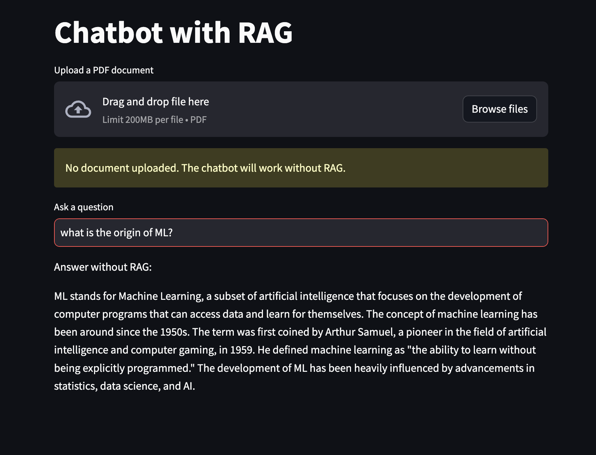
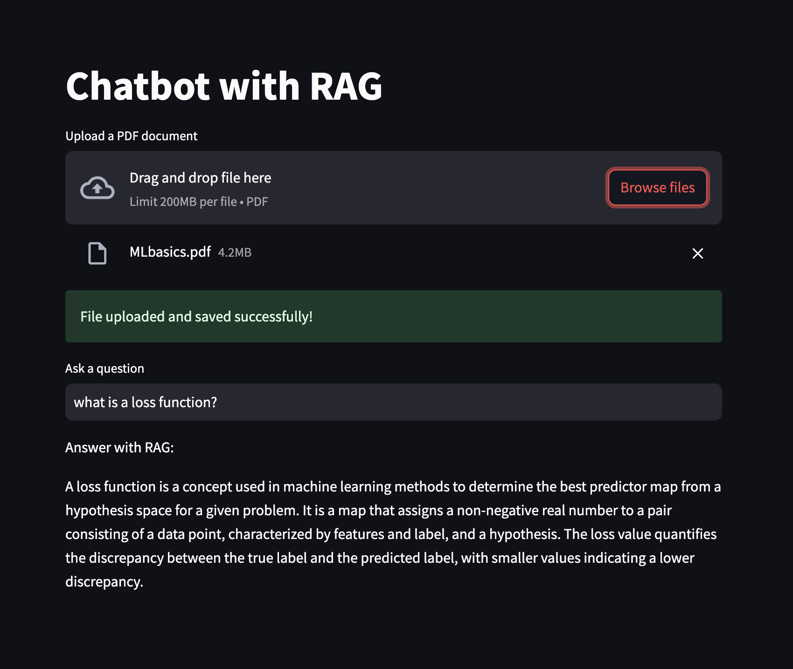

# OpenAI-to-Open-source
A simple RAG POC that shows how to use vLLM to move from OpenAI GPT-4 LLM to IBM Granite instruct model.This example uses Chroma as the database for storing embeddings of a PDF file and LangChain as the framework for Retrieval-Augmented Generation (RAG).

1. Install Python 3.8 or higher
2. Download this code repository (install git if it is not already setup, You can also downlod the zip file directly from the main page under code option as an alternate)

```
      brew install git
      git clone https://github.com/AhilanPonnusamy/OpenAI-to-Open-source.git
```
   
4. Create a new virtual environment from a terminal
   
```
     python3 -m venv .venv
```

4. Activate the vitual environment

```
    source .venv/bin/activate
```


5. Install dependencies

```
    pip install -r requirements.txt
```

6. Add your OpenAI API Key to **OPENAI_API_KEY** variable in **.env** file. You can create OpenAI API Key at **https://platform.openai.com/api-keys**

## Testing OpenAI GPT-4 LLM and OpenAI Embeddings 

1. Run OpenAI chatbot App

```
    streamlit run chatbot_ui.py
```

2. Try a random question **what is the origin of ML?**. Once submitted, you will see some activity in streamlit console and in about 20 seconds a generic LLM response is dislayed in the UI as shown below.


3. Upload a PDF file (you may also try MLbasics.pdf provided in this project). Wait for the file to be uploaded and embeddings created and stored in the vector DB. Try a random question with the information provided in the uploaded file ** e.g., **what is a loss function?**. You will see a relevant response displayed on the screen as shown below.

   
## Testing with Open source IBM Granite and all-MiniLM-L6-v2 Embeddings 

1. **chatbot_ui_granite.py** contains all changes required for IBM Granite and all-MiniLM-L6-v2 Embedding model integration.

2. Setup InstructLab following the instruction up to **Initializing InstructLab and a Taxonomy project** section from **https://developers.redhat.com/blog/2024/06/12/getting-started-instructlab-generative-ai-model-tuning#**.  
3. 
4. 
5. 

***Have fun!!!!!***
